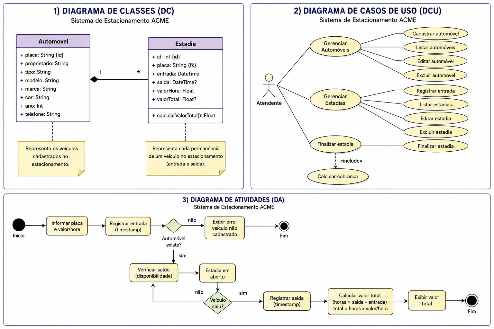
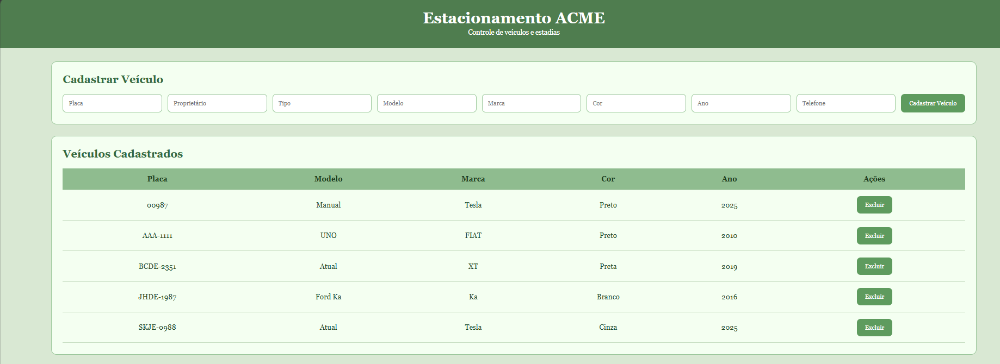
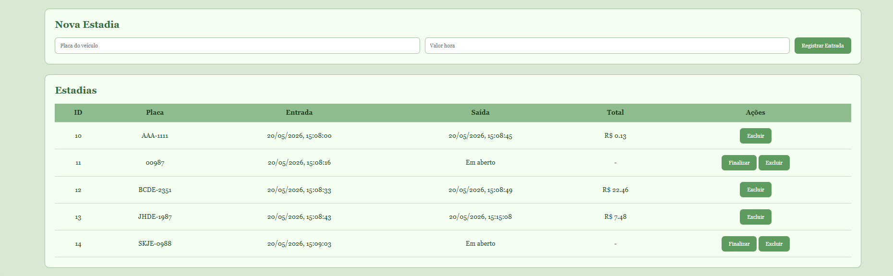

# 🚗 Estacionamento ACME

Sistema Full Stack para gerenciamento de estacionamento, permitindo cadastro de veículos, controle de estadias e cálculo automático de valores.

---


### Diagrama de Classes (DC)/ DCU (Diagrama de Casos de Uso) e DA (Diagrama de Atividades)]



---

# 📷 Imagens do Sistema

### Cadastro de Veículos



---

### Cadastro e Histórico de Estadias



---

# 🛠 Tecnologias Utilizadas

| Camada | Tecnologia |
|---------|------------|
| Frontend | HTML5 |
| Frontend | CSS3 |
| Frontend | JavaScript |
| Backend | Node.js |
| API | Express |
| ORM | Prisma |
| Banco de Dados | MySQL |
| Comunicação HTTP | Fetch API |

---

# 🚀 Como Executar


## 1. Clonar o projeto

```bash
git clone https://github.com/MIRELLA-02/senai-full-stack-estacionamento-2026.git
```

---

## 2. Instalar dependências

Backend:

```bash
npm install
```

---

## 3. Configurar variáveis de ambiente

Criar arquivo:

```text
.env
```

Adicionar:

```env
PORT=3000

DATABASE_URL="mysql://root@localhost:3306/mydb"
```

---

## 4. Gerar Prisma

```bash
npx prisma generate
```

---

## 5. Executar migrations

```bash
npx prisma migrate dev
```

---

## 6. Rodar API

```bash
npm run dev
```

Servidor:

```text
http://localhost:3000
```

---

## 7. Abrir Frontend

Abrir:

```text
index.html
```

Ou utilizar:

- Live Server (VSCode)

---

# 🧪 Funções que cada um faz?

### Automóveis

- ✅ Cadastrar veículo
- ✅ Listar veículos
- ✅ Buscar veículo
- ✅ Atualizar veículo
- ✅ Excluir veículo

---

### Estadias

- ✅ Registrar entrada
- ✅ Registrar saída
- ✅ Buscar estadia
- ✅ Atualizar estadia
- ✅ Excluir estadia
- ✅ Cálculo automático do valor total

---


# 📌 Métodos API

## Automóvel

| Método | Endpoint |
|---------|-----------|
| POST | /automovel/cadastrar |
| GET | /automovel/listar |
| GET | /automovel/buscar/:placa |
| PUT | /automovel/atualizar/:placa |
| DELETE | /automovel/excluir/:placa |

---

## Estadia

| Método | Endpoint |
|---------|-----------|
| POST | /estadia/cadastrar |
| GET | /estadia/listar |
| GET | /estadia/buscar/:id |
| PUT | /estadia/atualizar/:id |
| DELETE | /estadia/excluir/:id |

---

# 👩‍💻 Desenvolvido por

**Mirella Brolezi**

Projeto desenvolvido para atividade Full Stack — SENAI.